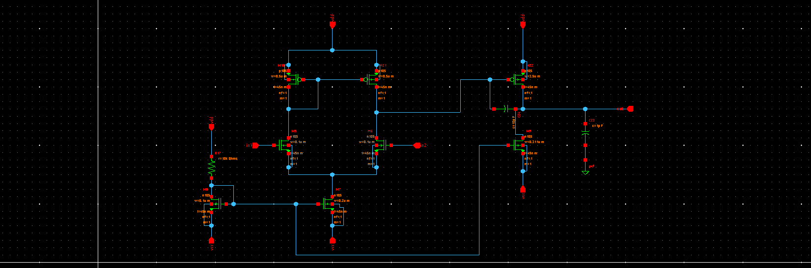
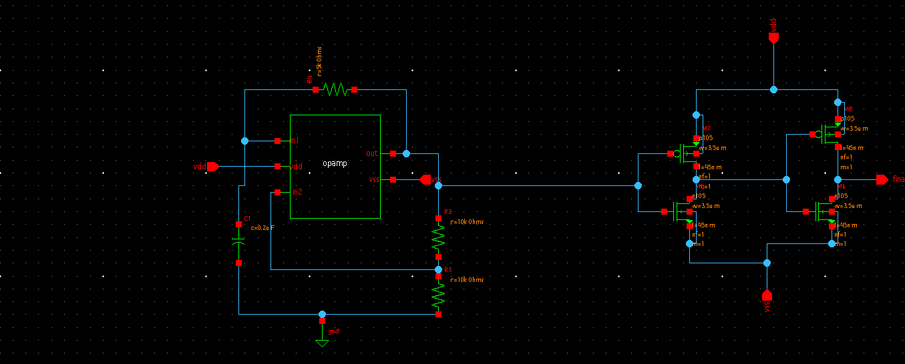
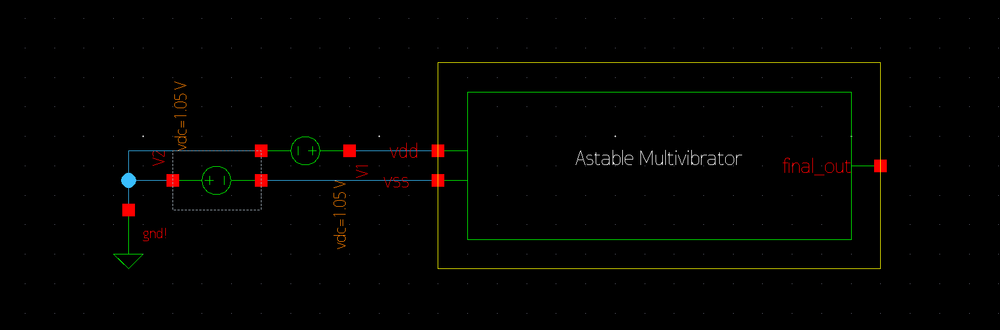
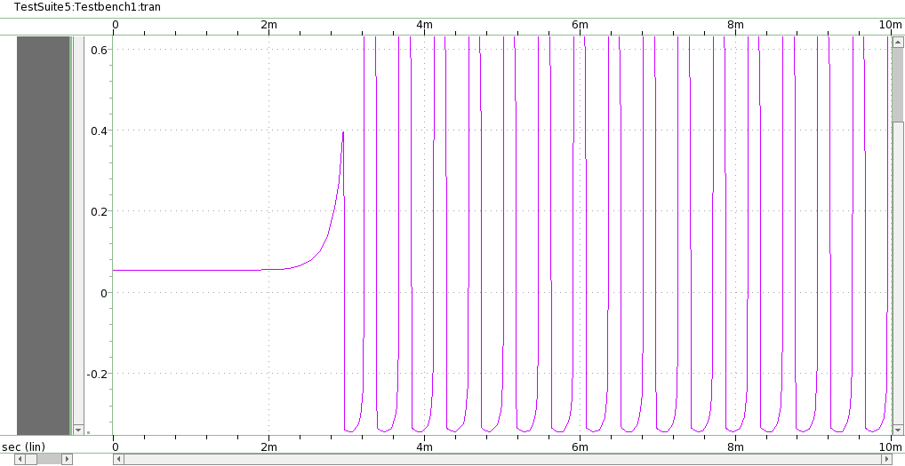

# Astable Multivibrator using OpAmp

This repository presents a report for the *Analog IC Design Hackathon* using *Synopsys Custom Design Tool* implementing **Astable Multivibrator using Operational Amplifier** using Synopsys SAED 32nm Process Design Kit (PDK)

---

# Contents
- [Introduction](#introduction)
- [Description](#description)
- [Tools Used](#tools-used)
- [Schematic](#schematic)
- [Output Waveform](#output-waveform)
- [Acknowlegements](#acknowledgements)
- [References](#references)

# Introduction
This repo presents the design of an Astable Multivibrator using Operational Amplifier with CMOS Technology. Astable Multivibrator is an unstable circuit that oscillates between two states with the help of a RC feedback network, which can also be used as Pulse Generator or clock signal for digital circuit. The circuit can produce different frequency based on the value of resistors and capacitors chosen, this circuit gets no input except for the DC bias and produces oscillating output. This kind of pulse generation is power efficient, simple and inexpensive.

# Description

Astable multivibrator is a circuit that oscillates between wo unstable stages generating a rectangular wave which is controlled by the rate of charging and discharging of the capacitor. The design using operational amplifier is considered here. The circuit uses a RC timing network connected to the inverting terminal and a voltage dividing network connected to non-inverting terminal of opamp to generate rectangular pulses of different frequency. Here the opamp operates like a schmitt comparator, the voltage across the capacitor is compared with a part of output (using voltage dividing network) to get new output. Usage of potentiometer at the feedback network to non-inverting terminal gives rise to tunable output frequency.

# Tools used
- Synopsys Custom Compiler

- SAED32nm PDK

# Schematic

# Output Waveform

# Report By
 - R.V.Rohinth Ram
# Acknowledgements
- Kunal Ghosh, Co-founder, VLSI System Design (VSD) Corp. Pvt. Ltd. - kunalpghosh@gmail.com
- Sameer S Durgoji

# References
[1] D. Nageshwarrao, K. S. Kumar, Y. R. Rao, and G. Jyothi, "Implementation and simulation of cmos two stage operational amplifier,"
*International Journal of Advances in Engineering & Technology*, vol. 5, no. 2, p. 162, 2013.

[2] B. Panda, S. Dash, and S. Mishra, "High slew rate op-amp design for low power applications," in 2014 *International Conference on Control, Instrumentation, Communication and Computational Technologies* (ICCICCT),pp 1096–1100, IEEE, 2014

[3] S. Franco, *Design with operational amplifiers and analog integrated
circuits*, vol. 1988. McGraw-Hill New York, 2002.

---
