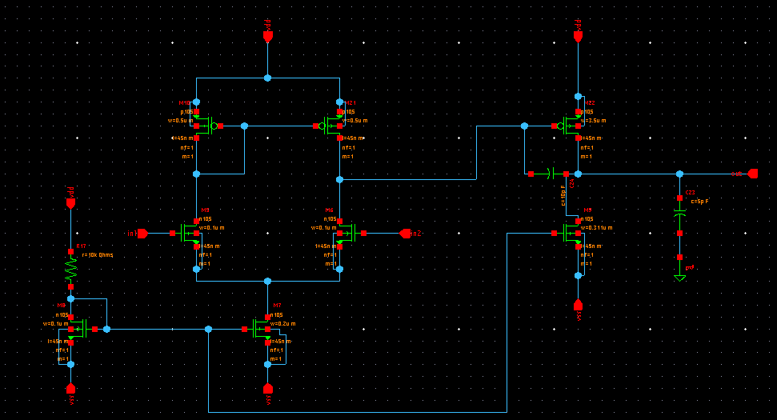
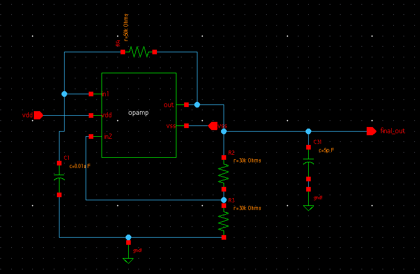
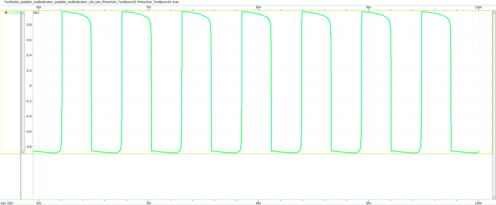

# Astable Multivibrator using OpAmp


This repository presents a report for the *Analog IC Design Hackathon* using *Synopsys Custom Design Tool* implementing **Astable Multivibrator using Operational Amplifier** using Synopsys SAED 32nm Process Design Kit (PDK)


---

# Contents
- [Introduction](#introduction)
- [Description](#description)
- [Tools Used](#tools-used)
- [Schematic](#schematic)
- [Netlist](#netlist)
- [Output Waveform](#output-waveform)
- [Acknowlegements](#acknowledgements)
- [References](#references)


# Introduction
This repository presents the design of an Astable Multivibrator using Operational Amplifier with CMOS Technology. Astable Multivibrator is an unstable circuit that oscillates between two states with the help of a RC feedback network, which can also be used as Pulse Generator or clock signal for digital circuit. The circuit can produce different frequency based on the value of resistors and capacitors chosen, this circuit gets no input except for the DC bias and produces oscillating output. This kind of pulse generation is power efficient, simple and inexpensive.

# Description

Astable multivibrator is a circuit that oscillates between wo unstable stages generating a rectangular wave which is controlled by the rate of charging and discharging of the capacitor. The design using operational amplifier is considered here. The circuit uses a RC timing network connected to the inverting terminal and a voltage dividing network connected to non-inverting terminal of opamp to generate rectangular pulses of different frequency. Here the opamp operates like a schmitt comparator, the voltage across the capacitor is compared with a part of output (using voltage dividing network) to get new output. Usage of potentiometer at the feedback network to non-inverting terminal gives rise to tunable output frequency.


# Tools used
- Synopsys Custom Compiler


- SAED32nm PDK

# Schematic
- Two Stage CMOS Operational Amplifier


- Astable Multivibrator using OPAMP


- Simulation circuit


# Netlist
Netlist extracted from the tool 

```
*  Generated for: PrimeSim
*  Design library name: astable_multivibrator
*  Design cell name: opamp_sim
*  Design view name: schematic
.lib 'saed32nm.lib' TT

*Custom Compiler Version S-2021.09
*Thu Feb 24 11:15:40 2022

.global gnd!
********************************************************************************
* Library          : astable_multivibrator
* Cell             : opamp
* View             : schematic
* View Search List : hspice hspiceD schematic spice veriloga
* View Stop List   : hspice hspiceD
********************************************************************************
.subckt opamp in1 in2 out vdd vss
r17 vdd net75 r=10k
xm21 net79 net53 vdd vdd p105 w=0.5u l=45n nf=1 m=1
xm22 out net79 vdd vdd p105 w=3.5u l=45n nf=1 m=1
xm10 net53 net53 vdd vdd p105 w=0.5u l=45n nf=1 m=1
xm7 net29 net75 vss vss n105 w=0.2u l=45n nf=1 m=1
xm6 net79 in2 net29 net29 n105 w=0.1u l=45n nf=1 m=1
xm5 net53 in1 net29 net29 n105 w=0.1u l=45n nf=1 m=1
xm9 out net75 vss vss n105 w=0.311u l=45n nf=1 m=1
xm8 net75 net75 vss vss n105 w=0.1u l=45n nf=1 m=1
c23 out gnd! c=5p
c24 out net79 c=10p
.ends opamp

********************************************************************************
* Library          : astable_multivibrator
* Cell             : opamp_sim
* View             : schematic
* View Search List : hspice hspiceD schematic spice veriloga
* View Stop List   : hspice hspiceD
********************************************************************************
xi0 in1 in2 out net11 net41 opamp
v17 in2 gnd! dc=0 sin ( 0 -1m 1k 0 0 0 )
v16 in1 gnd! dc=0 sin ( 0 1m 1k 0 0 0 )
v18 net11 gnd! dc=1.05
v20 gnd! net41 dc=1.05

.tran '.1u' '5m' name=tran

.option primesim_remove_probe_prefix = 0
.probe v(*) i(*) level=1
.probe tran v(in1) v(in2) v(out)

.temp 25

.option primesim_output=wdf

.option parhier = LOCAL

.end

```

# Output Waveform
- Operational Amplifier

- Astable Multivibrator


- Achieved Square Wave



# Report By
 - R.V.Rohinth Ram

# Acknowledgements
- Kunal Ghosh, Co-founder, VLSI System Design (VSD) Corp. Pvt. Ltd. - kunalpghosh@gmail.com
- Sameer S Durgoji
- [Synopsys](https://www.synopsys.com/)
- India Institute of Technology Hydrabad


# References
[1] D. Nageshwarrao, K. S. Kumar, Y. R. Rao, and G. Jyothi, "Implementation and simulation of cmos two stage operational amplifier,"
*International Journal of Advances in Engineering & Technology*, vol. 5, no. 2, p. 162, 2013.

[2] B. Panda, S. Dash, and S. Mishra, "High slew rate op-amp design for low power applications," in 2014 *International Conference on Control, Instrumentation, Communication and Computational Technologies* (ICCICCT),pp 1096–1100, IEEE, 2014

[3] S. Franco, *Design with operational amplifiers and analog integrated
circuits*, vol. 1988. McGraw-Hill New York, 2002.

---
